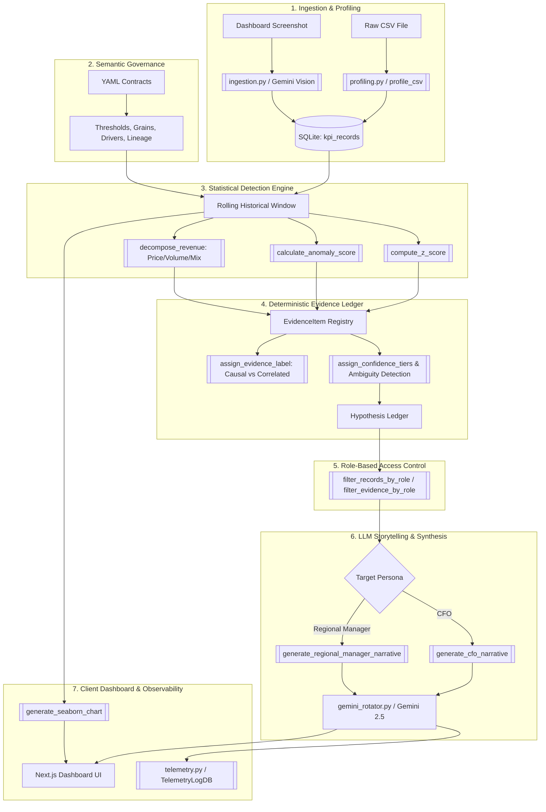

# VeriSight AI: Architecture, Pipeline & Project Structure

**VeriSight AI** is a **hybrid deterministic/LLM KPI intelligence-to-action engine prototype**. It demonstrates a robust enterprise architecture combining strict, reproducible statistical analytics (Z-scores, p-values, Price/Volume/Mix decomposition, deterministic evidence rule chains) with Google Gemini LLMs for unstructured document/screenshot understanding and executive storytelling.

The platform strictly enforces the **Deterministic vs. LLM-Assisted boundary**: LLMs are strictly restricted from computing math, determining statistical validity, or hallucinating causes without direct evidence.

---

## 1. Project Directory Structure

```plaintext
verisightai/
├── README.md                              # Project overview and runbook
├── PROJECT_STRUCTURE_AND_PIPELINE.md      # Comprehensive technical architecture & pipeline reference
├── backend/                               # Python FastAPI analytical core
│   ├── main.py                            # Application entry point & API endpoints
│   ├── requirements.txt                   # Backend dependencies
│   ├── contracts/                         # Semantic KPI contracts (YAML definitions)
│   │   ├── revenue.yaml                   # Revenue KPI contract (drivers, thresholds, lineage)
│   │   ├── marketing_conversion.yaml      # Marketing conversion KPI contract
│   │   └── churn_signal.yaml              # Churn signal KPI contract
│   ├── core/                              # Core configuration & runtime infrastructure
│   │   ├── config.py                      # Environment and model settings (pydantic-settings)
│   │   ├── contracts.py                   # Pydantic schema & loader for YAML contracts
│   │   └── gemini_rotator.py              # API key rotation, client pooling & retry logic
│   ├── data/                              # Database layer
│   │   └── db.py                          # SQLite engine, sessions, schema migration
│   ├── models/                            # Relational & transfer data models
│   │   └── schema.py                      # SQLAlchemy ORM and Pydantic schemas
│   ├── services/                          # Business logic & domain engines
│   │   ├── access.py                      # Role-based access control (RBAC / RLS)
│   │   ├── analytics.py                   # Dashboard orchestration & Seaborn chart rendering
│   │   ├── detection.py                   # Statistical anomaly detection & PVM decomposition
│   │   ├── evidence.py                    # Deterministic hypothesis builder & ambiguity resolution
│   │   ├── ingestion.py                   # CSV & screenshot ingestion pipelines
│   │   ├── metadata.py                    # AST code scanner for #DETERMINISTIC / #LLM-ASSISTED tags
│   │   ├── narrative.py                   # Persona-driven prompt templates (CFO vs. Regional Manager)
│   │   ├── profiling.py                   # CSV classification, formula discovery, correlations
│   │   ├── synthetic.py                   # Multi-factor anomaly generator for testing/demo
│   │   └── telemetry.py                   # Latency, token accounting, and cost tracking decorator
│   ├── static/charts/                     # Server-generated chart cache
│   └── tests/                             # Unit and integration test suites
│
└── frontend/                              # Next.js 14 Web Application
    ├── package.json                       # Frontend dependencies (React 18, Next 14, Tailwind)
    ├── next.config.js                     # Next.js configuration
    ├── tsconfig.json                      # TypeScript configuration
    ├── tailwind.config.js                 # Tailwind CSS styling configuration
    └── app/                               # Next.js App Router
        ├── layout.tsx                     # Root layout & global styling
        ├── page.tsx                       # Landing page
        ├── globals.css                    # Design system & CSS rules
        ├── components/
        │   └── UploadForm.tsx             # File drag-and-drop ingestion interface
        ├── dashboard/
        │   ├── page.tsx                   # Dashboard route wrapper
        │   └── DashboardClient.tsx        # Dynamic dashboard, chart viewer & AI chat UI
        └── upload/
            └── page.tsx                   # Dedicated ingestion portal
```

---

## 2. End-to-End Data Pipeline



---

### Step 1: Ingestion & Automated Profiling
* **Files**: `backend/services/ingestion.py`, `backend/services/profiling.py`
* **Mechanisms**:
  1. **Structured CSV Ingestion**:
     - Columns are parsed and automatically classified into **Numeric**, **Date**, or **Categorical** (`classify_columns`).
     - **Formula Discovery**: `discover_formulas` evaluates column combinations in numeric samples to discover arithmetic identities ($A \approx B \times C$, $Revenue = Price \times Volume$).
     - **Correlation Matrix**: Calculates Pearson correlation coefficients against candidate KPI targets to identify leading/lagging factors.
     - **Time Series Rollup**: Determines grain (`daily`, `weekly`, `monthly`) and normalizes dates into `KPIRecordDB` entries in SQLite.
  2. **Multimodal Screenshot Ingestion**:
     - Visual dashboard screenshots (PNG, JPG, WebP) are ingested via Google Gemini Vision (`gemini-2.5-flash`).
     - Structured JSON extraction enforces schemas matching `FlexibleDashboard`, extracting metrics, series points, timestamps, and units without fixed layout assumptions.

---

### Step 2: Semantic Contracts & Governance
* **Files**: `backend/core/contracts.py`, `backend/contracts/*.yaml`
* Invariant business logic is stored in declarative YAML files:
  - **Metric Definition & SQL Calculation**: Authoritative definitions (e.g., `SUM(order_value) WHERE status = 'completed'`).
  - **Grain & Cadence**: Expected operational granularity (`daily`, `weekly`, `monthly`).
  - **Authorized Drivers**: Valid factors allowed for root cause analysis (e.g., `price`, `volume`, `mix`, `channel`).
  - **Alert Thresholds**: Dynamic Z-score trigger levels (`z_score_alert`, `z_score_high_confidence`).
  - **Access Roles**: RBAC entitlements (`cfo`, `regional_manager`).

---

### Step 3: Statistical Detection Engine & Decomposition
* **Files**: `backend/services/detection.py`
* All algorithms in this module are annotated `# DETERMINISTIC`:
  1. **Rolling Trailing Windows**:
     - 28 periods for daily grain, 8 for weekly, 6 for monthly (`get_window_size`).
  2. **Z-Score Anomaly Computation**:
     $$Z = \frac{x_t - \mu_{window}}{\sigma_{window}}$$
  3. **Composite Anomaly Confidence Score**:
     $$\text{Score} = \text{Magnitude} \times \text{Significance} \times \text{Persistence} \times \text{Business Impact}$$
     - *Magnitude*: Normalized absolute deviation $\min(|Z| / 5.0, 1.0)$.
     - *Significance*: Two-tailed p-value significance $1.0 - 2 \cdot \Phi(-|Z|)$ using `scipy.stats.norm.sf`.
     - *Persistence*: Fraction of the last 5 time periods exceeding $1\sigma$.
     - *Business Impact*: Relative ratio of deviation against baseline $\min(|\Delta| / |Baseline|, 1.0)$.
  4. **Sparse History Guardrail**:
     - If history $< 21$ periods, Z-score computation is suspended to prevent false alarms; falls back to peer-group baseline comparisons.
  5. **Price/Volume/Mix (PVM) Decomposition**:
     - Isolates driver impact on revenue variances:
       $$\Delta Revenue = \underbrace{(P_1 - P_0)V_0}_{\text{Price Effect}} + \underbrace{(V_1 - V_0)P_0}_{\text{Volume Effect}} + \underbrace{(P_1 - P_0)(V_1 - V_0)}_{\text{Mix Effect}}$$

---

### Step 4: Deterministic Evidence Ledger & Hypothesis Formation
* **Files**: `backend/services/evidence.py`
* Anomalies are translated into immutable `EvidenceItem` records containing lineage paths, confidence, source IDs, and empirical findings.
* **Causality Attribution Engine**:
  - `causal_evidence_supports`: Requires a verified controlled comparison or A/B experiment.
  - `likely_contributed_to`: Requires $\ge 2$ independent sources and verified temporal precedence ($t_{driver} < t_{kpi}$).
  - `correlated_with`: Single-source or purely concurrent observational evidence.
* **Ambiguity Detection**:
  - Compares the weighted strength of competing hypotheses (`calculate_hypothesis_strength`).
  - If the top two hypotheses are within $15\%$ strength of one another, both are categorized as `AMBIGUOUS`, triggering an automated recommendation to execute an A/B test.

---

### Step 5: Persona-Targeted LLM Narrative Synthesis
* **Files**: `backend/services/narrative.py`, `backend/core/gemini_rotator.py`
* Tagged `# LLM-ASSISTED` with strict JSON mode output.
* **CFO Persona**:
  - Implements a financial materiality threshold (e.g., impact must exceed $\$10,000$).
  - Produces concise, 3-4 sentence summaries focused exclusively on dollar impact without operational jargon.
* **Regional Manager Persona**:
  - Delivers an operational action matrix detailing primary drivers, percentage contributions, controllable levers, assignable owners, and monitoring plans.
* **Anti-Hallucination Guardrails**: The LLM prompt binds synthesis strictly to the evidence ledger JSON; introducing unverified numbers or root causes is prohibited.

---

### Step 6: Security & Role-Based Access Control (RBAC)
* **Files**: `backend/services/access.py`
* Dimension-level filtering ensures users only access data within their assigned domain:
  - `global_cfo`: Unrestricted access across all regions (`ALL`) at summary level.
  - `regional_manager_apac`: Strictly filters out any metric, row, or evidence lineage referencing restricted regions (`EMEA`, `NA`, `LATAM`).

---

### Step 7: Telemetry, Observability & Key Rotation
* **Files**: `backend/services/telemetry.py`, `backend/core/gemini_rotator.py`, `backend/services/metadata.py`
* **Telemetry**:
  - The `@with_telemetry` decorator measures invocation latency, tracks token counts (`tokens_in`, `tokens_out`), and calculates costs based on Gemini pricing into `telemetry_logs`.
  - Response caching prevents duplicate LLM calls by hashing prompt inputs via MD5.
* **Resilience (GeminiKeyRotator)**:
  - Pools multiple API keys and cycles on `429 / ResourceExhausted` with retry logic.
* **Code Auditing**:
  - `backend/services/metadata.py` scans the codebase via Python AST and catalogs all functions tagged `# DETERMINISTIC` vs `# LLM-ASSISTED` via the `/metadata/tags` endpoint.

---

### Step 8: Frontend UI & Visualization Layer
* **Files**: `frontend/app/dashboard/DashboardClient.tsx`, `frontend/app/components/UploadForm.tsx`
* **Next.js 14 Client**:
  - Role switcher (`APAC Manager` vs `Global CFO`) and persona switcher (`Regional Manager` vs `CFO`).
  - Real-time KPI cards with deviation metrics and anomaly badges.
  - Server-side Matplotlib/Seaborn visualization caching (`matplotlib.use('Agg')`), serving plots from `/static/charts/`.
  - Interactive chat panel for contextual question-answering grounded in project data.

---

## 3. Technical Glossary

| Technical Term | Definition in VeriSight AI |
| :--- | :--- |
| **Hybrid Deterministic/LLM** | Architectural pattern where statistical evaluations and causality checks are strictly executed in deterministic code, while LLMs are restricted to multimodal extraction and narrative synthesis. |
| **Semantic Contract** | A declarative YAML specification for a business metric defining its grain, drivers, calculation logic, lineage, and sensitivity thresholds. |
| **Z-Score ($\mathbf{Z}$)** | The number of standard deviations a data point lies above or below the rolling window's historical mean. |
| **Two-Tailed p-value** | The statistical probability that an observed variation occurred due to random chance ($p < 0.05$ flags statistical significance). |
| **Anomaly Confidence Score** | A compound score ($\in [0, 1]$) combining Magnitude, Significance, Persistence, and Business Impact. |
| **PVM Decomposition** | Mathematical separation of revenue variance into discrete Price Effect, Volume Effect, and Mix Effect. |
| **Evidence Ledger** | An immutable collection of facts (`EvidenceItem`) tracing back to raw data files, timestamps, and detection methods. |
| **Temporal Precedence** | Requirement that an assumed driver must exhibit measurable variation *prior* to or concurrently with the dependent metric anomaly. |
| **Controlled Comparison** | Empirical verification against an unaffected control group (required before labeling evidence as causal). |
| **Materiality Threshold** | A financial cutoff (e.g., $\$10,000$) below which operational anomalies are suppressed from executive CFO narratives. |
| **Key Rotator & Backoff** | Client resilience mechanism in `gemini_rotator.py` cycling across API keys upon encountering rate limits (HTTP 429 / Resource Exhausted). |
| **Row-Level Security (RLS)** | Filtering records at the dimension boundary based on user role entitlements before analytics or narratives are generated. |
